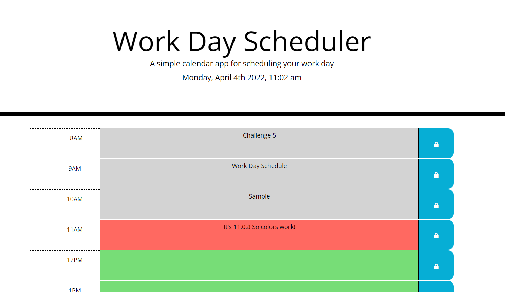

# Work Day Scheduler Starter Code
## Challenge Requirements:
GIVEN I am using a daily planner to create a schedule  
WHEN I open the planner  
THEN the current day is displayed at the top of the calendar  
WHEN I scroll down  
THEN I am presented with time blocks for standard business hours  
WHEN I view the time blocks for that day  
THEN each time block is color-coded to indicate whether it is in the past, present, or future  
WHEN I click into a time block  
THEN I can enter an event  
WHEN I click the save button for that time block  
THEN the text for that event is saved in local storage  
WHEN I refresh the page  
THEN the saved events persist    

## Summary
The goal is to create a schedule for "normal business hours" which I consider to be 8AM-5PM. The schedule needs to have the time blocks change color as the time changes. The events need to persist through page refreshes, and only save when the save button (lock icon) is clicked. CSS styles were provided in order to make the definitions of certain elements more consistent and easier to identify.

## Problems
This project had very few problems as it felt quite easy. I did not feel that I hit any major road blocks. One problem I did run into was the storage and loading of data. The probelm was that attaining certain values within the code was harder using jQuery just due to a lack of experience. One reason is that I would forget that jQuery notations work as functions and require () at the end; for example
.text vs .text(). I found myslef looking through jQuery documentation for what function I needed to do the job.

## Important Functions 
### checkEvents()
This function steps through each time-block and checks the time block id (which is a militrary time) against the current time. From this comparison, it attaches a class to the time-block which in turn sets the background color.  

### loadTimeSlots() and saveEvents()
These two functions create and store the data for the events saved.

### Event Listeners on the Time-blocks
The events we listen for are a click on the "p" and save button.
If you click the "p" element, a textarea input is dynamically generated and filled with the current text value of the "p" element. Then once the save(lock) button is clicked, the element is the switched back to a "p" element with whatever was typed in the textarea as the text value, then the event is saved locally and in a variable. 

### Time interval
This time interval rewrites the time at the top of the page each minute and then checks to see if the event colors need to be updated, using checkEvents().

## Results
Here you can see comments added to the schedule along with the working color coding time system.  

Repository can be accessed here: [Work Day Schedule Repository](https://github.com/ecarlson0123/work-day)  
  
Deployed website can be accessed here: [Work Day Schedule Website](https://ecarlson0123.github.io/work-day/)  

